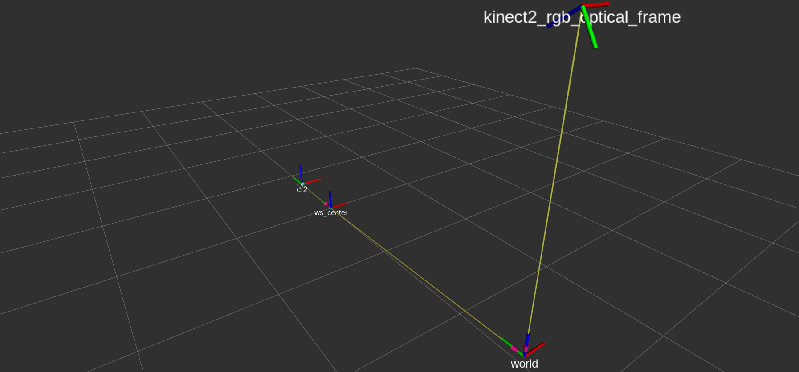
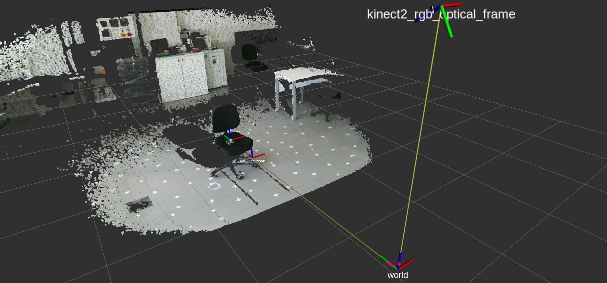
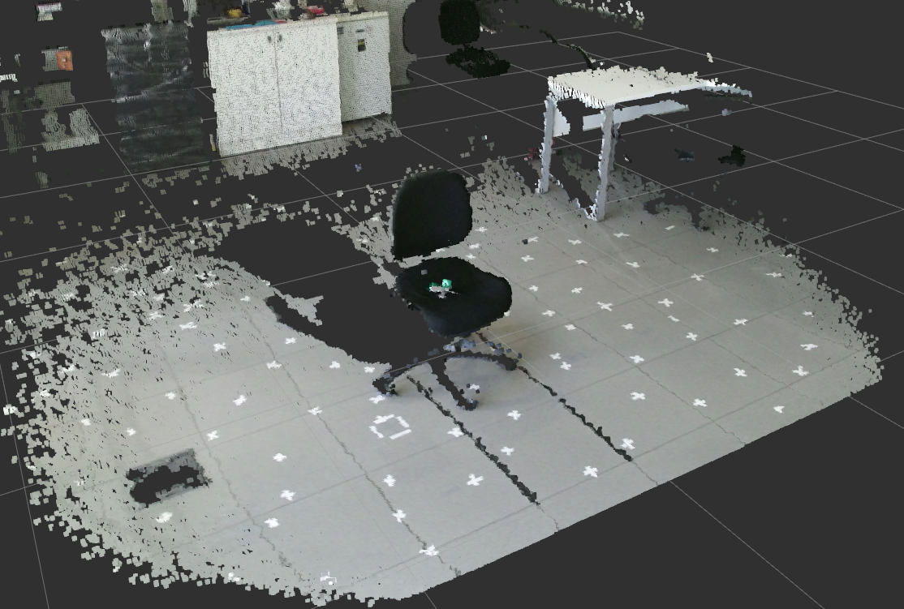
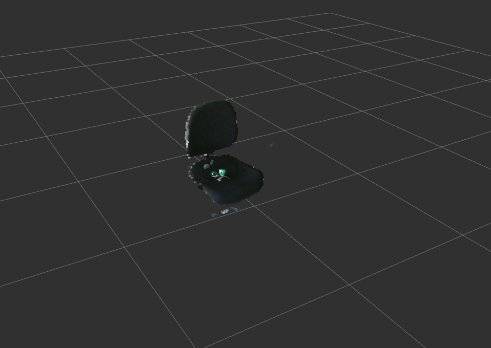
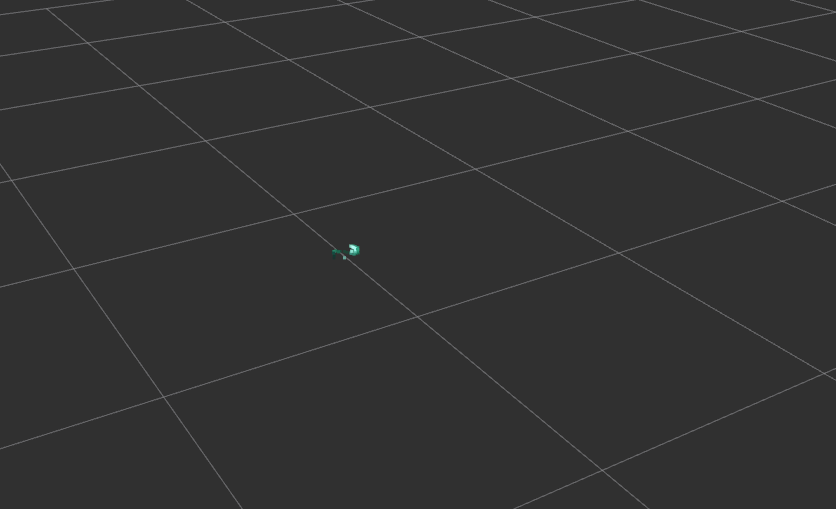

# Crazyflie Kinect Localization

This project aims to develop necessary software to detect ping-pong balls located on top of CrazyFlie2.X hardware, to both identify 
and localize the quadrotor.

## Purpose of This Project
This repository is actively used in my senior design project, NN-based multi agent CrazyFlie swarm formation control, which for localization we didn't have VICON systems. So I've tried to solve the localization of 3 Crazyflie's with a single Kinect v2 Sensor.

## Setup, Location Of the Kinect v2 Sensor, and the Workspace/Flight Zone
The Kinect Sensor is located approx 2.17 meters high pointing to ground tilted. The transformation between the Workspace Center / Flight Zone `/ws_center` and the `/kinect2_rgb_optical_frame` is defined in `launch/localization.launch` file.

Transform Tree:


Transform Tree with point clouds:



`Note:` The launch file contains 3 transformations. The `/world` transformation is just a `*bridge*` and is `*not*` necessary, I've used that point (world) to take measurements. You can directly supply the transformation between `ws_center` and `kinect2_rgb_optical_frame`.
 
`Todo:` The transformation between `kinect2_rgb_optical_frame` and `kinect2_ir_optical_frame` is given same, the transformation from `kinect2_ir_optical_frame` to `kinect2_rgb_optical_frame` can be given by the datasheet of the sensor.

## How it works

The working principle of this package is fairly simple, here is how it works step by step.

- First, the `launch/localization.launch` file is launched. This file launches the necessary nodes such as kinect_bridge, the filters, transform nodes etc.

- The Kinect v2 sensor, outputs a point cloud data on `/kinect2/qhd/points` topic in `sensor_msgs/PointCloud2`. A raw sensor output can be seen below.

    


- A CropBox Filter node, is cropping the input point cloud to given workspace box range     definitions, specified in `config/default.yaml` file. If the `use_transform` parameter is `1`, the input point cloud will be transformed from `base_frame` to `target_frame`. If transform is 1, the `x, y, z` `min/max` parameters will be defined in the `target_frame`. In this case the transformation target frame is Workspace Center (Flight Zone) `ws_center`. A CropBox Filter applied to points with `x:-1,+1 y:-1,+1 z:0.1,1.5`
    


- A Color Filter node, is applying a RGB/HSI conditional filter, which filters the points within the range defined in `config/default.yaml` file. 

    If the `use_hsi` parameter is `1`, `r,g,b` field parameters are 
    considered as `h,s,i` respectively. Example, `r_min` is Minimum Hue value. Hue value, ranges between `(-128, 127)` representing `-pi, +pi`, saturation and intensity values are ranging between `(0, 255)`

    A Color Filter applied to cropped points can be seen below:
    


The position output of the detected ping pong ball, is given as a `Transform Message` as `/cfX` with parent frame as `ws_center` (`\cfX` -> `ws_center` transform is provided), also as a `geometry_msgs/PointStamped` in topic  `/cfX/pose`


## Dependencies
- `pcl_ros`
    ```
    sudo apt install ros-melodic-pcl-ros
    ```
- `Freenectv2`

    Follow the instructions on [Freenectv2](https://github.com/OpenKinect/libfreenect2) and install on your platform.

- `kinect2_bridge`
    
    Install iai_kinect2 packages in your workspace src folder directory: `catkin_ws/src/`
    ```
    git clone https://github.com/code-iai/iai_kinect2
    ```


## Installation

Create your workspace and source folder `src/`, or use already existing one. in this example, our workspace is located at `~/catkin_ws/`

Change to workspace source folder directory
```
cd catkin_ws/src/
git clone https://github.com/senceryazici/crazyflie_kinect_localization.git
cd ../
catkin build
```

## Run

```
roslaunch crazyflie_kinect_localization localization.launch
```

## License

This package is licensed under MIT License, See [License](LICENSE) for more details.

## Author

Sencer Yazici, [senceryazici@gmail.com](mailto:senceryazici@gmail.com)

## Contribution & Future Work

Any kind of contribution is welcomed, if you have any issues, feel free to open an issue.


